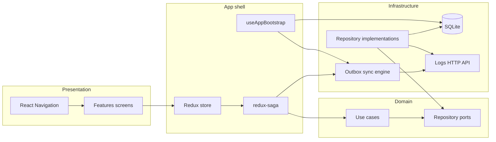

# Farming Log

React Native mini-app for farmers to log daily field activities. Built offline-first: data is stored locally and sync runs when the network allows.

---

## Prerequisites (environment)

| Tool | Version / notes |
| --- | --- |
| **Node.js** | **>= 22.11.0** (see `package.json` → `engines`) |
| **Package manager** | npm or Yarn (examples below use `npm`) |
| **Watchman** (macOS, recommended) | [Install Watchman](https://facebook.github.io/watchman/docs/install) for reliable Metro file watching |
| **iOS** | **Xcode** (recent stable, aligned with React Native 0.85), **CocoaPods**, **iOS 15.1+** deployment target |
| **Android** | **Android Studio** with **SDK 36**, **JDK 17** (typical for current AGP / RN), **minSdk 24** |

Also follow the official guide: [Set up your environment](https://reactnative.dev/docs/set-up-your-environment).

---

## Install

1. Clone the repository and install JS dependencies:

   ```sh
   cd farming
   npm install
   ```

2. **iOS — CocoaPods** (first clone and whenever native dependencies change):

   ```sh
   cd ios
   pod install
   cd ..
   ```

3. **Environment files** — the app uses `APP_ENV` (`development` \| `uat` \| `production`) and loads `.env.<APP_ENV>` at build time via Babel (see `babel.config.js`). Ensure `.env.development`, `.env.uat`, etc. exist locally (they are not committed if ignored by git; copy from your team’s secrets template if applicable).

---

## Run the app

Start Metro in one terminal (pick the environment you need):

```sh
npm start                 # APP_ENV=development (default)
npm run start:uat         # APP_ENV=uat
npm run start:production  # APP_ENV=production
```

In another terminal, run the native app.

### Android

```sh
npm run android           # dev debug
npm run android:uat       # uat debug
npm run android:prod      # production debug
```

Release-style builds (examples):

```sh
npm run android:release:dev
npm run android:release:uat
npm run android:release:prod
```

### iOS

```sh
npm run ios               # development
npm run ios:uat           # uat
npm run ios:production    # production (debug)
npm run ios:production:release
```

You can also open `ios/farming.xcworkspace` in Xcode or the `android` folder in Android Studio and run from the IDE.

---

## Tests & quality

```sh
npm test
npm run test:coverage
npm run lint
```

---

## Project tree

Repository layout (excluding `node_modules`, `ios/Pods`, and build outputs):

```text
farming/
├── App.tsx                    # Root component (providers, root navigator)
├── index.js                   # Metro entry
├── package.json
├── babel.config.js            # Env injection + path aliases (@app, @data, …)
├── metro.config.js
├── tsconfig.json
├── android/                   # Gradle project, product flavors (dev / uat / prod)
├── ios/                       # Xcode workspace `farming.xcworkspace`, app target `farming/`
├── src/
│   ├── app/                   # Application shell
│   │   ├── components/
│   │   ├── hooks/             # e.g. useAppBootstrap (DB, i18n, sync bootstrap)
│   │   ├── navigation/        # Root navigator, stacks, drawer
│   │   └── store/             # Redux store, rootSaga, dependencies wiring
│   ├── config/                # Env-driven settings (e.g. logs HTTP)
│   ├── data/                  # Infrastructure
│   │   ├── api/               # REST clients (e.g. logs)
│   │   ├── db/                # SQLite open, DAOs, migrations
│   │   ├── mocks/
│   │   └── repository/        # Port implementations
│   ├── domain/                # Business core
│   │   ├── entities/
│   │   ├── policies/
│   │   ├── ports/             # Repository / remote interfaces
│   │   └── usecases/
│   ├── features/              # Product features (screens, hooks, slice, saga)
│   │   ├── logs/              # components/, hooks/, screens/, sagas/, store/
│   │   └── settings/
│   ├── libs/                  # Cross-cutting helpers (i18n, logger, network, theme)
│   ├── locales/               # i18n JSON (en, vi, …)
│   ├── services/              # Background + sync orchestration
│   │   ├── background/
│   │   └── sync/              # Outbox engine, job handlers, backoff
│   └── ui/                    # Design system
│       ├── components/
│       ├── navigation/
│       ├── theme/
│       └── tokens/
├── docs/                      # Requirements / notes
├── scripts/                   # Tooling (icons, DB export, schema migrate, …)
├── assets/                    # e.g. bootsplash assets
├── patches/                   # patch-package diffs
└── __tests__/                 # Jest tests (use cases, sync, components, …)
```

Path aliases (see `babel.config.js` / `tsconfig.json`): `@app`, `@config`, `@data`, `@domain`, `@features`, `@libs`, `@services`, `@ui`.

---

## ARCHITECTURE

### Layered model

Dependencies point **inward**: outer layers may call inner ones; domain does not depend on React or SQLite.

| Layer | Folders | Responsibility |
| --- | --- | --- |
| **Presentation** | `src/features/`, `src/ui/`, `src/app/navigation/` | Screens, hooks tied to UI, shared components & theme |
| **Application state** | `src/app/store/`, `src/features/*/{store,sagas}/` | Redux store, root saga; feature slices & sagas → use cases |
| **Domain** | `src/domain/` | Entities, use cases, ports (interfaces) |
| **Infrastructure** | `src/data/`, `src/services/` | SQLite, HTTP, outbox sync, background triggers |
| **Cross-cutting** | `src/libs/`, `src/config/` | i18n, logging, NetInfo bootstrap, env config |

### Runtime data flow (simplified)



Typical **write path**: screen → dispatch action → saga → use case → repository → SQLite first → enqueue sync job when online. **Read path**: saga or bootstrap → use case → repository → SQLite → store → UI.

### Tech stack (library choices)

- **State:** Redux Toolkit + **redux-saga** (side effects, sync triggers).
- **Persistence:** **react-native-sqlite-storage** + versioned migrations under `src/data/db/migrations/`.
- **Sync:** **Outbox-style** pipeline in `src/services/sync/`, **NetInfo** in `src/libs/network/` for connectivity-aware behavior.
- **Navigation:** **React Navigation** (drawer + native stack).
- **UI:** **react-native-paper** + `src/ui/theme` & tokens.
- **Forms:** **react-hook-form** + **Zod**.
- **i18n:** **i18next** / **react-i18next**, resources in `src/locales/`.
- **Motion / native perf:** Reanimated, Gesture Handler, Screens.
- **Splash:** react-native-bootsplash.
- **Patches:** `patch-package` on `postinstall`.

---

## Improvements / future enhancements

- **True remote API** — replace or extend the mock `LogsApi` with a real backend, auth, and conflict resolution policies.
- **Richer sync UX** — per-item sync state, retry UI, and clearer error surfaces when sync fails after backoff.
- **Observability** — structured remote logging / crash reporting in non-dev builds.
- **Accessibility** — audit labels, focus order, and dynamic type on key screens.
- **E2E tests** — Detox or Maestro for critical flows (add log → offline → sync).
- **CI** — lint, unit tests, and optional Android/iOS build jobs on every PR.

---

## Troubleshooting

- **Metro / cache**: `npx react-native start --reset-cache`
- **iOS build issues**: clean build folder in Xcode, delete Derived Data, then `cd ios && pod install`
- **React Native setup**: [Troubleshooting](https://reactnative.dev/docs/troubleshooting)

---

## Learn more

- [React Native documentation](https://reactnative.dev/docs/getting-started)
# farmingLog
